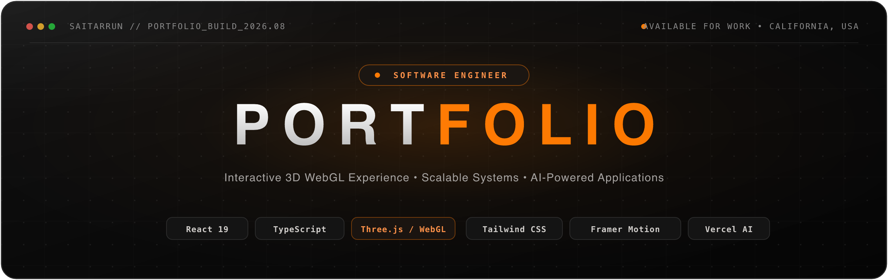

<p align="center">
  
</p>

<h1 align="center">Sai Tarrun Pitta — Portfolio</h1>

<p align="center">
  <strong>Interactive 3D Personal Portfolio & Engineering Showcase</strong>
  <br />
  Built with React 19, TypeScript, Three.js / React Three Fiber, Tailwind CSS, Framer Motion, and Lenis.
  <br />
  <br />
  <a href="https://saitarrunpitta.vercel.app"><strong>🚀 Live Demo</strong></a> •
  <a href="https://github.com/saitarrun/SoftwareEngineer_Portfolio"><strong>GitHub Repository</strong></a> •
  <a href="https://linkedin.com/in/saitarrunpitta"><strong>LinkedIn Profile</strong></a>
</p>

<p align="center">
  
  
  
  
  
  
  
</p>

---

## 📖 Overview

This repository houses the source code for **Sai Tarrun Pitta's** personal portfolio website. Designed under the **"Neon Architect"** design language, the application combines high-performance WebGL graphics, tactile spring physics, glassmorphic UI layers, and an integrated RAG-powered AI chatbot assistant.

### Key Highlights

- **WebGL 3D Background Engine**: GPU-accelerated background powered by Three.js and React Three Fiber featuring particle dynamics, morphing noise blobs, wireframe globes, and matrix cascades.
- **Micro-Interactions & Kinetic Typography**: Spring-physics letter tracking on the hero headline, 3D card tilt with radial cursor spotlight tracking, and magnetic buttons.
- **RAG-Powered Chat Assistant**: Integrated interactive assistant backed by a semantic knowledge base and Vercel serverless function.
- **Inertial Smooth Scrolling**: Powered by `@studio-freight/lenis` (Lenis React) with automatic touch/mobile fallbacks.
- **Modern Responsive Design**: Fluid typography using CSS `clamp()`, glassmorphic backdrops with fallback handling, and full mobile optimization.

---

## 🏗️ Comprehensive Project Scaffold & File Tree

The workspace is organized into modular directories separating 3D graphics pipelines, reusable UI components, centralized data models, serverless backend APIs, and build tooling:

```
SoftwareEngineer_Portfolio/
├── 📁 api/                               # Vercel Serverless Functions (Backend)
│   ├── chat.ts                           # AI Assistant endpoint with streaming & fallback retrieval
│   ├── knowledge-base.json               # Server-side ground truth dataset for chatbot prompt injection
│   └── types.ts                          # Chat API request & response TypeScript definitions
│
├── 📁 public/                            # Static Web Assets & Documents
│   ├── banner.svg                        # Minimalistic high-resolution portfolio banner
│   ├── og-image.png                      # OpenGraph social share card
│   ├── PittaSaiTarrun_Resume.pdf         # Downloadable software engineering resume (PDF)
│   ├── profile.webp                      # Compressed webp headshot
│   ├── robots.txt                        # Search engine crawler instructions
│   └── sitemap.xml                       # SEO XML sitemap
│
├── 📁 src/                               # Application Frontend Source Code
│   ├── 📁 components/                    # React UI Section Components
│   │   ├── 📁 ui/                        # Low-level reusable UI primitives
│   │   │   ├── Button.tsx                # Accessible action buttons
│   │   │   ├── Card.tsx                  # Base card container
│   │   │   ├── GlassCard.tsx             # Glassmorphic container with frosted border
│   │   │   ├── Section.tsx               # Section wrapper with standard max-width & padding
│   │   │   └── ShinyButton.tsx           # Shimmer accent CTA button
│   │   ├── ChatWidget.tsx                # Interactive AI assistant floating modal & drawer
│   │   ├── Contact.tsx                   # Contact section with interactive links & social channels
│   │   ├── CustomCursor.tsx              # Custom mouse trailing cursor effect
│   │   ├── Education.tsx                 # Academic milestones, degrees, and coursework highlights
│   │   ├── Experience.tsx                # Work experience timeline with company deliverables
│   │   ├── Hero.tsx                      # Hero header with fluid kinetic typography & quick stats
│   │   ├── MagneticElement.tsx           # Physics wrapper imparting magnetic pull on cursor hover
│   │   ├── Navbar.tsx                    # Frosted glass navbar with scrollspy & reading progress bar
│   │   ├── Projects.tsx                  # 3D interactive tilt cards with cursor spotlight glow
│   │   ├── Publications.tsx              # Research papers and academic publications
│   │   └── Skills.tsx                    # Categorized technical skill matrix
│   │
│   ├── 📁 data/                          # Data Layer & Knowledge Base
│   │   ├── portfolio.tsx                 # Typed content for experience, projects, skills, and education
│   │   └── knowledge-base.json           # Client-side knowledge base for instant offline chatbot answers
│   │
│   ├── 📁 three/                         # Three.js 3D WebGL Rendering Pipeline
│   │   ├── 📁 hooks/                     # Custom graphics hooks
│   │   ├── BackgroundCanvas.tsx          # Master R3F Canvas wrapper with performance presets
│   │   ├── HeroScene.tsx                 # Composed 3D scene orchestrating mesh components
│   │   ├── ParticleField.tsx             # Interactive GPU floating particle constellation
│   │   ├── LiquidBlob.tsx                # Perlin noise vertex-displaced liquid sphere
│   │   ├── WireframeGlobe.tsx            # Geodesic rotating wireframe globe
│   │   ├── MatrixRain.tsx                # Cascading vertical character stream in 3D coordinates
│   │   ├── OrangeSmoke.tsx               # Volumetric animated smoke shader particles
│   │   ├── FloatingGeometry.tsx          # Geometric polyhedrons rotating in 3D space
│   │   ├── GridPlane.tsx                 # Perspective infinite floor grid
│   │   ├── PostEffects.tsx               # Post-processing bloom and chromatic aberration
│   │   ├── constants.ts                  # 3D color palettes, particle counts, and camera parameters
│   │   ├── useMousePosition.ts           # Normalized viewport mouse coordinate tracker (-1 to 1)
│   │   └── useScrollProgress.ts          # Window scroll progress tracker for 3D camera transitions
│   │
│   ├── 📁 utils/                         # Helper Utilities
│   │   └── retrieval.ts                  # Keyword extraction & TF-IDF style semantic search for chatbot
│   │
│   ├── App.tsx                           # Main application layout, Lenis provider & lazy imports
│   ├── main.tsx                          # React 19 root entrypoint & DOM mounting
│   ├── index.css                         # Tailwind CSS v4 setup, design tokens & glassmorphic utility classes
│   └── vite-env.d.ts                     # Vite client type declarations
│
├── 📁 tests/                             # Automated Test Suites
│   └── e2e/                              # Playwright end-to-end integration and smoke tests
│
├── .github/                              # GitHub Actions CI/CD workflows
├── Dockerfile                            # Production multi-stage Docker container build
├── docker-compose.yml                    # Local container orchestration
├── nginx.conf                            # High-performance Nginx reverse proxy configuration
├── package.json                          # Project dependencies, scripts, and engine specifications
├── playwright.config.ts                  # Cross-browser Playwright test configuration
├── tailwind.config.js                    # Custom color variables, animations, and typography tokens
├── tsconfig.json                         # TypeScript compiler configuration (ESNext, React JSX)
├── vercel.json                           # Vercel deployment routes, headers, and caching rules
└── vite.config.ts                        # Vite configuration with chunk splitting & alias resolution
```

---

## 🔬 Deep Dive: Architecture & Implementation

### 1. 3D WebGL Pipeline (`src/three/`)

- Built with **React Three Fiber (R3F)** and **Three.js**.
- **`BackgroundCanvas.tsx`**: Sets up the WebGL renderer with pixel ratio clamping (`dpr={[1, 1.5]}`), `powerPreference="high-performance"`, and lazy suspension.
- **Particle & Shader Mechanics**:
  - `ParticleField.tsx` creates buffer geometries storing thousands of vertex positions updated each frame via `useFrame()`.
  - `LiquidBlob.tsx` computes vertex offsets via custom 3D simplex noise to simulate organic surface fluidity.
  - `useMousePosition.ts` feeds smoothed target coordinates to interpolate camera tilt and object rotations without frame stutter.

### 2. Micro-Interactions & Physics (`src/components/`)

- **Fluid Kinetic Typography (`Hero.tsx`)**: Each character in the name header is wrapped in an individual `FluidLetter` component utilizing Framer Motion's `useSpring` and `useMotionValue` to magnetically repel/attract relative to the cursor distance.
- **Spotlight 3D Project Cards (`Projects.tsx`)**: Calculates normalized cursor coordinates across the card surface (`xPct`, `yPct`) to compute multi-axis 3D rotations (`rotateX`, `rotateY`) while moving a dynamic `radial-gradient` spotlight overlay in real time.
- **Magnetic Buttons (`MagneticElement.tsx`)**: Reusable wrapper that computes bounding client rect offsets and applies gentle elastic spring translations to interactive badges and buttons.

### 3. AI Assistant & Hybrid Retrieval (`api/chat.ts` + `src/components/ChatWidget.tsx`)

- Provides an on-demand floating chat interface capable of answering inquiries about experience, tech stacks, projects, and contact info.
- **Hybrid Retrieval System**:
  - Client-side keyword retrieval (`src/utils/retrieval.ts`) offers zero-latency instant responses.
  - Serverless endpoint (`api/chat.ts`) handles deeper queries with semantic knowledge grounding and fallback reasoning.

### 4. Design System & Styling (`src/index.css` + `tailwind.config.js`)

- **Theme Palette**:
  - Base Surface: `#0e0e0e` (Deep void black)
  - Surface Low/High: `#131313` / `#201f1f`
  - Neon Primary Accent: `#ff9249` / `#ff7b04` (Luminous orange)
  - Glass Card: `rgba(22, 19, 16, 0.75)` with `backdrop-filter: blur(30px)`
- **Typography Stack**:
  - Display: `'Plus Jakarta Sans', sans-serif`
  - Body: `'Inter', sans-serif`
  - Monospace / Labels: `'Space Grotesk', 'JetBrains Mono', monospace`

---

## 🚀 Getting Started

### Prerequisites

- **Node.js**: `v18.0.0` or higher (Node 20+ recommended)
- **Package Manager**: `npm`, `pnpm`, or `yarn`

### Installation

1. **Clone the repository:**

   ```bash
   git clone https://github.com/saitarrun/SoftwareEngineer_Portfolio.git
   cd SoftwareEngineer_Portfolio
   ```

2. **Install dependencies:**

   ```bash
   npm install
   ```

3. **Launch the local development server:**
   ```bash
   npm run dev
   ```
   Open your browser at `http://localhost:5173`.

---

## 🛠️ Available Scripts

| Command                | Description                                                             |
| :--------------------- | :---------------------------------------------------------------------- |
| `npm run dev`          | Starts Vite local development server with hot module replacement (HMR)  |
| `npm run build`        | Compiles TypeScript and creates optimized production bundle in `dist/`  |
| `npm run preview`      | Runs a local web server to preview the production build                 |
| `npm run type-check`   | Runs `tsc --noEmit` to validate all TypeScript types across the project |
| `npm run lint`         | Runs ESLint to verify code quality and style conventions                |
| `npm run lint:fix`     | Automatically fixes auto-resolvable ESLint issues                       |
| `npm run format`       | Formats all source files with Prettier                                  |
| `npm run format:check` | Verifies that all repository files conform to Prettier styling          |
| `npm run test:e2e`     | Executes Playwright cross-browser end-to-end integration tests          |

---

## 🐳 Docker Deployment

A multi-stage `Dockerfile` and `docker-compose.yml` are included for containerized hosting:

```bash
# Build and run container locally on port 8080
docker-compose up --build -d
```

Access the containerized instance at `http://localhost:8080`.

---

## 🌐 Deployment to Vercel

This project is preconfigured for zero-config deployments on **Vercel**:

1. Connect your repository to [Vercel](https://vercel.com).
2. Framework preset will automatically detect **Vite**.
3. Build Command: `npm run build`
4. Output Directory: `dist`
5. Optional Environment Variables:
   - `OPENAI_API_KEY` or `GEMINI_API_KEY` (for AI Chat assistant backend)

---

## 📄 License

Distributed under the **MIT License**. See `LICENSE` for details.

---

<p align="center">
  Crafted with precision by <strong><a href="https://linkedin.com/in/saitarrunpitta">Sai Tarrun Pitta</a></strong>
</p>
